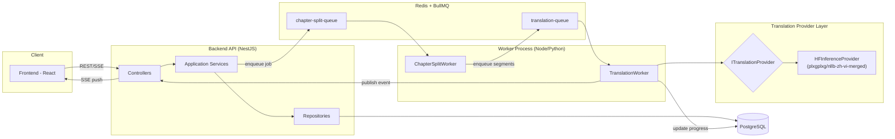

# SPEC: Hệ Thống Web Dịch Truyện Tự Động (Zh → Vi)

> Tài liệu này mô tả đầy đủ luồng nghiệp vụ, kiến trúc, data model, API và frontend flow
> để đưa cho AI coding agent implement trực tiếp. Nguyên tắc thiết kế tuân theo SOLID.

---

## 1. Tổng Quan Hệ Thống

**Mục tiêu:** Người dùng upload truyện (raw text tiếng Trung, chia theo chương), hệ thống
tự động dịch sang tiếng Việt bằng model `plxgplxg/nllb-zh-vi-merged` (NLLB fine-tuned,
LoRA đã merge, gọi qua HF Inference API), lưu lại thành sách theo chương, cho phép đọc
online. Toàn bộ quá trình dịch chạy **bất đồng bộ (async worker)** vì:

- Model chỉ dịch được câu ngắn ≤ 120 ký tự/lần gọi → 1 chương phải tách thành N segment.
- Dịch hàng trăm/nghìn segment mất nhiều thời gian → không thể chờ trong 1 HTTP request.
- Cần retry khi model API rate-limit / timeout.

**Nguyên tắc SOLID áp dụng xuyên suốt:**
- **S**ingle Responsibility: mỗi service chỉ làm 1 việc (chunking, calling model, persisting, notifying).
- **O**pen/Closed: thêm ngôn ngữ mới / provider dịch mới (nếu sau này cần) không sửa code cũ,
  chỉ thêm implementation mới cho `ITranslationProvider`.
- **L**iskov: mọi `ITranslationProvider` implementation phải thay thế cho nhau được.
- **I**nterface Segregation: interface nhỏ, tách riêng `IChunker`, `ITranslationProvider`, `IJobRepository`.
- **D**ependency Inversion: Service tầng trên chỉ phụ thuộc interface, không phụ thuộc HF API hay Bull cụ thể.

---

## 2. Kiến Trúc Tổng Thể



**Thành phần chính:**

| Thành phần | Vai trò |
|---|---|
| **Backend API** | Nhận upload, tạo Book/Chapter, expose REST + SSE endpoint theo dõi tiến độ |
| **Redis + BullMQ** | Hàng đợi job (2 queue: tách chương → dịch segment) |
| **Worker** | Tiến trình riêng (scale độc lập với API) xử lý job |
| **Translation Provider Layer** | Interface trừu tượng gọi model dịch qua HF Inference API (model đã merge) |
| **PostgreSQL** | Lưu Book, Chapter, Segment, TranslationJob, trạng thái |

---

## 3. Data Model (PostgreSQL)

```
User
 - id (uuid, pk)
 - email
 - password_hash
 - created_at

Book
 - id (uuid, pk)
 - user_id (fk -> User)
 - title
 - original_title
 - source_lang       -- 'zh'
 - target_lang        -- 'vi'
 - status             -- enum: draft | processing | partial | completed | failed
 - cover_url (nullable)
 - created_at
 - updated_at

Chapter
 - id (uuid, pk)
 - book_id (fk -> Book)
 - chapter_number (int)
 - title_original
 - title_translated (nullable)
 - raw_content (text)              -- nội dung gốc tiếng Trung
 - translated_content (text, nullable)  -- ghép lại sau khi dịch xong
 - status              -- enum: pending | splitting | translating | done | failed
 - total_segments (int)
 - completed_segments (int)
 - created_at
 - updated_at
 - UNIQUE(book_id, chapter_number)

Segment
 - id (uuid, pk)
 - chapter_id (fk -> Chapter)
 - segment_index (int)        -- thứ tự trong chương, dùng để ghép lại
 - source_text (varchar 160)  -- câu gốc, luôn <= 120 ký tự
 - translated_text (nullable)
 - status              -- enum: pending | translating | done | failed
 - retry_count (int, default 0)
 - error_message (nullable)
 - created_at
 - updated_at
 - UNIQUE(chapter_id, segment_index)

TranslationJob
 - id (uuid, pk)
 - book_id (fk -> Book)
 - chapter_id (fk -> Chapter, nullable)  -- null nếu job ở cấp book (submit toàn bộ)
 - job_type            -- enum: split_chapter | translate_chapter | translate_book
 - status              -- enum: queued | running | completed | failed
 - progress_percent (int, default 0)
 - bullmq_job_id (varchar)
 - error_message (nullable)
 - created_at
 - updated_at
```

**Vì sao tách `Segment` thành bảng riêng thay vì chỉ lưu mảng JSON trong `Chapter`:**
- Cho phép retry từng segment lỗi độc lập (không phải dịch lại cả chương).
- Cho phép hiển thị tiến độ real-time theo % segment hoàn thành.
- Cho phép parallelize dịch nhiều segment cùng lúc (worker concurrency).

---

## 4. Translation Provider Layer (phần quan trọng nhất)

### 4.1. Interface (Dependency Inversion)

```ts
// domain/interfaces/translation-provider.interface.ts
export interface ITranslationProvider {
  /**
   * Dịch 1 câu, đầu vào đã đảm bảo <= 120 ký tự.
   * Ném TranslationProviderError nếu lỗi (để worker retry).
   */
  translate(text: string, sourceLang: string, targetLang: string): Promise<string>;

  /**
   * Optional: dịch batch nếu provider hỗ trợ (giảm số lần gọi API).
   */
  translateBatch(texts: string[], sourceLang: string, targetLang: string): Promise<string[]>;
}
```

### 4.2. Implementation — HF Inference API (model đã merge LoRA)

> ✅ Đã hoàn tất: LoRA adapter đã được merge vào base model và push lên
> **`plxgplxg/nllb-zh-vi-merged`** (full model, không phụ thuộc thư viện `peft` khi inference).
> Đây là repo dùng chính thức cho `HFInferenceProvider` bên dưới. Repo cũ
> `plxgplxg/nllb-zh-vi-lora` (chỉ chứa adapter) không dùng trực tiếp cho web nữa, chỉ giữ
> lại làm nguồn train/backup.

```ts
// infrastructure/translation/hf-inference.provider.ts
export class HFInferenceProvider implements ITranslationProvider {
  private readonly endpoint = "https://api-inference.huggingface.co/models/plxgplxg/nllb-zh-vi-merged";

  async translate(text: string): Promise<string> {
    const res = await fetch(this.endpoint, {
      method: "POST",
      headers: {
        Authorization: `Bearer ${process.env.HF_TOKEN}`,
        "Content-Type": "application/json",
      },
      body: JSON.stringify({
        inputs: text,
        parameters: { src_lang: "zho_Hans", tgt_lang: "vie_Latn" },
      }),
    });

    if (res.status === 503) throw new ProviderColdStartError(); // model đang load, worker sẽ retry sau delay
    if (!res.ok) throw new TranslationProviderError(await res.text());

    const data = await res.json();
    return data[0].translation_text;
  }

  async translateBatch(texts: string[]): Promise<string[]> {
    // HF inference API cho seq2seq nhận được mảng input, trả về mảng output
    // Nhưng free tier dễ timeout nếu batch quá lớn -> giới hạn batch size ~8-16
  }
}
```

Provider được inject bằng NestJS custom provider token (`'ITranslationProvider'`) — code
nghiệp vụ (Worker, Service) chỉ phụ thuộc interface, không biết chi tiết gọi HF API như
thế nào (Dependency Inversion). Nếu sau này cần thêm provider khác, chỉ cần viết thêm 1
class implement `ITranslationProvider` mà không sửa code cũ (Open/Closed).

### 4.3. Chunking Algorithm (tách câu ≤ 120 ký tự)

**Input:** `raw_content` của 1 chương (text tiếng Trung, có thể vài nghìn ký tự).
**Output:** danh sách segment theo thứ tự, mỗi segment ≤ 120 ký tự, không cắt giữa câu.

```ts
// domain/services/chunker.service.ts
export class ChineseTextChunker implements IChunker {
  private readonly MAX_LEN = 120;
  // Dấu ngắt câu tiếng Trung: 。！？；…”
  private readonly SENTENCE_BOUNDARY = /(?<=[。！？；…])/;

  chunk(rawText: string): string[] {
    const paragraphs = rawText.split(/\n+/).filter(p => p.trim().length > 0);
    const segments: string[] = [];

    for (const para of paragraphs) {
      const sentences = para.split(this.SENTENCE_BOUNDARY).filter(s => s.trim());
      let buffer = "";

      for (const sentence of sentences) {
        if (sentence.length > this.MAX_LEN) {
          // Câu quá dài (hiếm) -> cắt cứng theo dấu phẩy/khoảng trắng gần nhất
          if (buffer) { segments.push(buffer); buffer = ""; }
          segments.push(...this.hardSplit(sentence));
          continue;
        }
        if ((buffer + sentence).length <= this.MAX_LEN) {
          buffer += sentence;
        } else {
          if (buffer) segments.push(buffer);
          buffer = sentence;
        }
      }
      if (buffer) segments.push(buffer);
      segments.push("\n"); // đánh dấu ranh giới đoạn văn để giữ format khi ghép lại
    }
    return segments;
  }

  private hardSplit(sentence: string): string[] {
    const parts: string[] = [];
    let remaining = sentence;
    while (remaining.length > this.MAX_LEN) {
      const cutAt = remaining.lastIndexOf("，", this.MAX_LEN) > 0
        ? remaining.lastIndexOf("，", this.MAX_LEN) + 1
        : this.MAX_LEN;
      parts.push(remaining.slice(0, cutAt));
      remaining = remaining.slice(cutAt);
    }
    if (remaining) parts.push(remaining);
    return parts;
  }
}
```

**Lưu ý quan trọng khi ghép lại (reassembly):**
- Segment `"\n"` là marker giữ vị trí xuống dòng, KHÔNG gửi cho model dịch — khi ghép lại
  gặp marker này thì insert `\n\n` vào `translated_content`.
- Lưu `segment_index` liên tục để đảm bảo ghép đúng thứ tự kể cả khi các segment được
  dịch song song (worker concurrency) và hoàn thành không theo thứ tự.

---

## 5. Luồng Nghiệp Vụ Chi Tiết (Async Flow)

### Bước 1 — Upload truyện
1. User gọi `POST /books` (tạo Book, status = `draft`).
2. User gọi `POST /books/:id/chapters` nhiều lần (mỗi lần 1 chương, hoặc upload 1 file
   `.txt`/`.epub` rồi backend tự tách chương theo pattern `第X章` / `Chapter X`).
3. Mỗi Chapter được tạo với status = `pending`.

### Bước 2 — User bấm "Dịch truyện"
1. `POST /books/:id/translate` → Service tạo 1 `TranslationJob` (job_type = `translate_book`),
   status = `queued`.
2. Với mỗi Chapter thuộc book, enqueue 1 job vào `chapter-split-queue` (BullMQ), payload
   `{ chapterId }`.
3. Trả về ngay `202 Accepted` + `jobId` cho frontend (không block).

### Bước 3 — ChapterSplitWorker xử lý (queue 1)
1. Nhận job `{ chapterId }`, set Chapter.status = `splitting`.
2. Gọi `ChineseTextChunker.chunk(chapter.raw_content)` → danh sách segment text.
3. Bulk insert vào bảng `Segment` (status = `pending`, segment_index tăng dần).
4. Set `Chapter.total_segments = segments.length`, `Chapter.status = 'translating'`.
5. Enqueue N job vào `translation-queue`, mỗi job = `{ segmentId }` (hoặc batch job
   `{ segmentIds: [...] }` nếu dùng `translateBatch` để giảm số request).

### Bước 4 — TranslationWorker xử lý (queue 2)
1. Nhận job `{ segmentId }`, set Segment.status = `translating`.
2. Gọi `translationProvider.translate(segment.source_text, 'zh', 'vi')`.
3. **Thành công:** lưu `translated_text`, status = `done`. Tăng
   `Chapter.completed_segments += 1` (transaction/atomic increment).
4. **Thất bại (timeout/rate-limit/503 cold start):**
   - `retry_count += 1`.
   - Nếu `retry_count < MAX_RETRY (vd 5)` → BullMQ tự retry với exponential backoff
     (config `attempts: 5, backoff: { type: 'exponential', delay: 2000 }`).
   - Nếu vượt quá → status = `failed`, lưu `error_message`, KHÔNG chặn các segment khác.
5. Sau mỗi lần update, kiểm tra: nếu `completed_segments == total_segments` (kể cả segment
   failed được tính là "đã xử lý xong, có thể có lỗi") →
   - Ghép toàn bộ segment theo `segment_index` thành `Chapter.translated_content`.
   - Set `Chapter.status = 'done'` (hoặc `'failed'` nếu có segment lỗi vượt ngưỡng cho phép,
     ví dụ > 5% segment lỗi thì đánh dấu chương cần review).
6. Publish event `chapter.progress` (qua Redis pub/sub hoặc EventEmitter nội bộ) chứa
   `{ chapterId, completed, total, percent }`.

### Bước 5 — Cập nhật tiến độ Book
1. Khi 1 Chapter chuyển sang `done`/`failed`, kiểm tra toàn bộ Chapter của Book.
2. Nếu tất cả `done` → `Book.status = 'completed'`.
3. Nếu có ít nhất 1 done nhưng chưa hết → `Book.status = 'partial'` (cho phép đọc phần
   đã dịch xong trong khi phần còn lại vẫn đang chạy).
4. Nếu tất cả failed → `Book.status = 'failed'`.

### Bước 6 — Frontend nhận cập nhật real-time
- Dùng **Server-Sent Events (SSE)** (đơn giản hơn WebSocket cho luồng 1 chiều server→client):
  `GET /books/:id/progress-stream` → server push event mỗi khi có Chapter/Segment cập nhật.
- Frontend fallback: polling `GET /books/:id/status` mỗi 3s nếu SSE không khả dụng.

---

## 6. API Endpoints

| Method | Path | Mô tả |
|---|---|---|
| POST | `/auth/register`, `/auth/login` | Auth cơ bản |
| POST | `/books` | Tạo book mới (metadata) |
| GET | `/books` | Danh sách book của user |
| GET | `/books/:id` | Chi tiết book + danh sách chapter |
| POST | `/books/:id/chapters` | Thêm 1 chương (raw text) |
| POST | `/books/:id/chapters/upload` | Upload file, tự tách chương |
| POST | `/books/:id/translate` | Bắt đầu dịch toàn bộ book |
| POST | `/chapters/:id/translate` | Dịch lại riêng 1 chương |
| POST | `/segments/:id/retry` | Retry riêng 1 segment lỗi |
| GET | `/books/:id/status` | Trạng thái tổng quan (polling) |
| GET | `/books/:id/progress-stream` | SSE stream tiến độ real-time |
| GET | `/chapters/:id` | Nội dung chương đã dịch (để đọc) |

---

## 7. Backend Module Structure (NestJS, SOLID layering)

```
src/
 ├─ modules/
 │   ├─ book/
 │   │   ├─ book.controller.ts
 │   │   ├─ book.service.ts          -- business logic, không biết BullMQ hay HTTP cụ thể
 │   │   ├─ book.repository.ts       -- implement IBookRepository
 │   │   └─ interfaces/
 │   ├─ chapter/
 │   │   ├─ chapter.controller.ts
 │   │   ├─ chapter.service.ts
 │   │   └─ chapter.repository.ts
 │   ├─ translation/
 │   │   ├─ interfaces/
 │   │   │   ├─ translation-provider.interface.ts
 │   │   │   └─ chunker.interface.ts
 │   │   ├─ providers/
 │   │   │   └─ hf-inference.provider.ts
 │   │   ├─ chunker/
 │   │   │   └─ chinese-text-chunker.ts
 │   │   ├─ translation.module.ts    -- factory tạo HFInferenceProvider
 │   │   └─ workers/
 │   │       ├─ chapter-split.worker.ts
 │   │       └─ translation.worker.ts
 │   └─ progress/
 │       └─ progress.gateway.ts       -- SSE endpoint
 ├─ queue/
 │   ├─ bullmq.config.ts
 │   └─ queues.module.ts
 └─ database/
     ├─ entities/ (Book, Chapter, Segment, TranslationJob)
     └─ migrations/
```

**Provider factory (Open/Closed — vẫn dùng factory để dễ thêm provider khác sau này mà
không đụng code Worker/Service):**
```ts
@Module({
  providers: [
    {
      provide: 'ITranslationProvider',
      useFactory: () => new HFInferenceProvider(),
    },
  ],
  exports: ['ITranslationProvider'],
})
export class TranslationModule {}
```

---

## 8. Frontend Flow (React)

### 8.1. Trang Upload / Quản lý truyện
- Form tạo Book (title, upload file hoặc paste text từng chương).
- Preview số chương được tự động tách ra trước khi confirm.
- Nút "Bắt đầu dịch" → gọi `POST /books/:id/translate`.

### 8.2. Trang Dashboard theo dõi tiến độ
- Danh sách Book với progress bar tổng (`completed_segments / total_segments` toàn bộ book).
- Mỗi Book expand ra danh sách Chapter với trạng thái riêng (pending/translating/done/failed).
- Subscribe SSE `progress-stream` khi vào trang, update UI real-time không cần reload.
- Chapter `failed` hiển thị nút "Retry" (gọi lại `POST /chapters/:id/translate`, chỉ retry
  segment `failed`, không dịch lại từ đầu).

### 8.3. Trang đọc truyện (Reader)
- Đọc theo chương, hiển thị `translated_content`.
- Nếu book đang `partial`, chương chưa xong hiển thị "Đang dịch..." thay vì lỗi.
- Điều hướng chương trước/sau, lưu tiến độ đọc (localStorage hoặc DB nếu cần).

### 8.4. State management gợi ý
- React Query (TanStack Query) cho fetch + cache + polling fallback.
- Context hoặc Zustand cho SSE connection state dùng chung toàn app.

---

## 9. Error Handling & Edge Cases

| Tình huống | Xử lý |
|---|---|
| Model API 503 (cold start) | Retry với backoff dài hơn (10-30s), không tính vào `retry_count` như lỗi thường |
| Model trả về text rỗng | Đánh dấu segment `failed`, lý do `EMPTY_TRANSLATION` |
| Segment quá dài do câu không có dấu ngắt (văn bản lỗi encoding) | Hard split theo số ký tự, log warning |
| User xoá book khi đang dịch dở | Soft-delete, worker check `book.deleted_at` trước khi xử lý, bỏ qua nếu đã xoá |
| Rate limit HF API (429) | Queue-level rate limiter (BullMQ `limiter: { max, duration }`) giới hạn số request/giây |
| Worker crash giữa chừng | BullMQ tự động re-queue job chưa `completed` (dùng `lockDuration` hợp lý) |
| Ghép chương bị thiếu segment (do lỗi index) | Validate tổng số segment trước khi ghép, nếu thiếu thì set `Chapter.status = 'failed'` kèm log chi tiết |

---

## 10. Tech Stack Đề Xuất

| Layer | Công nghệ |
|---|---|
| Backend API | NestJS + TypeScript |
| Queue | BullMQ + Redis |
| Database | PostgreSQL + TypeORM/Prisma |
| Translation Service | HF Inference API — model `plxgplxg/nllb-zh-vi-merged` (không tự host) |
| Frontend | React + TypeScript + TanStack Query + Zustand |
| Realtime | Server-Sent Events (SSE) |
| Deploy gợi ý | Backend + Worker trên VPS/Render, Redis + Postgres managed (Railway/Supabase) |

---

## 11. Thứ Tự Implement Gợi Ý Cho Agent

1. Setup DB schema + migration (Book, Chapter, Segment, TranslationJob).
2. Implement `ITranslationProvider` + `HFInferenceProvider` (gọi HF Inference API tới
   `plxgplxg/nllb-zh-vi-merged`). Có thể viết thêm 1 fake/mock provider để unit test
   Worker mà không phụ thuộc mạng ngoài.
3. Implement `ChineseTextChunker` + unit test kỹ (đây là phần dễ sai nhất, cần test với
   văn bản Trung thật có nhiều loại dấu câu).
4. Implement BullMQ queues + 2 worker (split, translate) chạy độc lập process.
5. Implement Book/Chapter CRUD API cơ bản (chưa cần dịch).
6. Nối luồng translate end-to-end (submit → queue → worker → DB → reassembly).
7. Implement SSE progress stream.
8. Implement frontend Upload → Dashboard → Reader.
9. Thêm retry-segment, error handling, rate limiting.
10. Test tải: 1 truyện ~50 chương, mỗi chương ~200 segment → đo throughput, tinh chỉnh
    concurrency worker.
